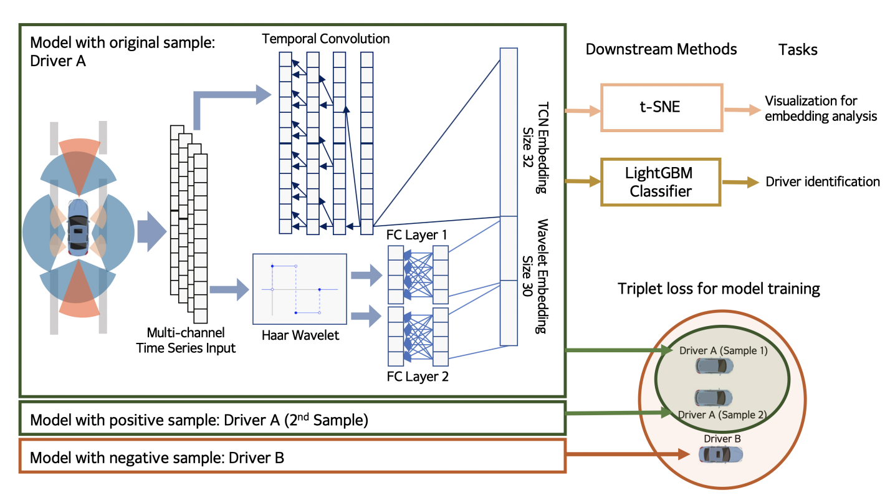

## TASK DIVISION
**CODE**
- LGBM (Pavan)
- Wavelet + FC layers (Tishar)

**BLOG**
- Explain data split (Pavan)
- Update model layout (Marcus)
- Results
- Dicussion: Not enough data, Decrease or split channels (Marnix)

## Structure
- Background
- Intro
- Explaining the data: Pavan
- Explanation (General architecture: TCN: Marcus, Triplet loss: Marnix, Haars: Tishar, LGBM classifier: Tishar)
- Approach taken (Same architecture but Data missing -> Cross-validation: Pavan, What do we have / Assumptions used: Marcus)
- Results / If it doesn't work -> our process so far / where we got stuck 
- Discussion (can't replicate)

## Introduction
### Background:
With privacy taking a center stand in all identification operations, alternative methods for driver identification have gained importance over time. 
Drivers’ use of turn indicators, following distance, rate of acceleration, etc. can be transformed to an embedding that is representative of their behavior and identity as it is very individualistic when compared to each driver. 

We try to harness this in order to create digital fingerprint of a driver based on these behaviors to assist in driver identification. But, drivers behave differently according to changing conditions and different road types and hence lot of training data is required to develop a highly capable system.The goal of the trained model is to detect the driver based on a short 10 second snippet of driving data. 

To achieve this goal,we design a customized deep learning architecture that leverages the advantages of temporal convolution with cross-correlation, the Haar wavelet transform, triplet loss and gradient boosted decision trees’. We train this model on a dataset of driving data collected from a driving simulator designed by Nervtech, a high-end driving simulation company.

### Overview of whole model:

## Dataset

The dataset used was collected froma driving simulator built by Nervtech that is demonstrated to reproduce an environment that invokes realistic driver reactions. 

The original dataset used by the paper contained a dataset where each driver spent approximately 15 minutes on the simulator, accumulating to more than 15 hours of driving in total. However, the entire dataset was unavailable for recreation and a sample dataset containing 10 seconds of data of each driver is available. Hence, complete recreation of the paper becomes impossible but a try of that is attempted.

The dataset is divided into groups as shown in the below figure to assess the impact of each group on the performance of the model. Pandas dataframe is used to load the model and divide into the sub-groups.

<!-- 

 -->

The dataset is further constructed as triplets(xr, xp and xn) as required in triplet loss. Here xr denotes an anchor point, xp denotes a positive sample of the same driver as xr, and xn a negative sample from a different driver.

<!-- 

 -->

## Network Architecture

### TCN

The neural network used in this paper is a Temporal Convolutional Networks. This network makes use multiple 1D fully convolutional network stacked on top of each other. A key characteristic of the TCN is that each ouput at time _t_ is only convolved with elements which are before _t_. In practise this means the last element in the series can see the whole series from the beginning. The following image shows how this structure looks.

<!-- 

 -->

### Triplet loss
The Loss function used for the TCN is triplet loss. With this loss function the reference input called the anchor  is compared with a matching positive pair  and a matching negative pair . This is done by feeding these data points through the current model and computing the distance between the anchor and its matching outputs. The loss is then defined as:

Here  is the margin and  is the distance. In this model, the loss optimization objective is then to achieve .

### Haar Wavelet
The haar wavelet transform is used as a method of indexing time series. Also known as DB1. This method is often better than discrete Fourier transform. The advantage it has over fourier transform is temporal resolution. It captures both frequency and  location information (location in time).  We use a Haar wavelet transformation to generates two vectors in the frequency domain. These vectors are cA and cD. Here cA is approximation coefficients vector and cD  is detail coefficients vector of the discrete wavelet transform The haar wavelet returns a tuple of cA and cD. Other application of Haar wavelet are de-noising and compression of signals and images. The vectors from Haar wavelet is then used as an input to a fully connected linear layer. The output then gets concatenated with the TCN output and fed to the  LightGBM classifier.

<!-- 

 -->

### LightGBM Classifier
After training the embedded model the LightGBM classifier is used to classify amoung the 5 drivers. LightGBM is a gradient boosting framework based on decision tree algorithms which is useful for classification, ranking, etc. The main advantages of this classifiere are:
- Lower memory usage
- Better accuracy
- Support of parallel and GPU learning
- Faster training speed an high effeciency.
- Can handle large size of data

LightGBM grows tree leaf-wise while other algorithms grow level-wise. It will choose the leaf with max delta loss to grow. When growing the same leaf. This leaf-wise growth helps it to reduce the loss more than level-wise algorithm.

<!-- 

 -->

<!-- 

 -->
The hyperparemeter used in the classifier are:-

<!-- 

 -->

## Approach taken

#### Model assumptions
The structure of our TCN was chosesn as follows: 
We have 5 TCN blocks in total. Each block contains 2 times a 1D Convolution, Chomp(remove extra padding), Relu and Dropout. A visual representation is seen in the image below:

<!-- 

 -->
The input of each block has 38 channels corresponding to each input signal and the final output also has 38 channels. Each channels has 10 seconds of driver data which amounts to a 1000 data points. The rest of the parameters used are:

- Kernel size = 16
- Padding = 2
- Stride = 1
- Dropout = 0.1

This is how the whole TCN sequence looks like:

<!-- 

 -->

## Results
At the moment we are able to train the model but unfortunately there is an issue with the computation of the loss. It seems the losses very large and the network is never able to optimize. Upon inspection of the outputs we think it'd due to the weights getting very large. 

## Discussion and Conclusion
As can be seen from the results, we were not able to fully replicate the paper. This is because for the replication, we only had a snippet of the full dataset. To account for this, both the model and input data were altered. Namely, for the model a simpler version was selected as it would be more prone to overfitting on this small amount of data. Likwise, the input data was split into TBD seconds instead of the ten seconds used in the paper. This resulted in less variation between the different input data. Which made the classification more trivial, as the testing data is very similar to the training data (there can only be a maximum of 8 seconds of difference between the tested datapoint and the training datapoint). However, as the model complexity is decreased and there is fewer training data, the performance of the model still decreased. 
